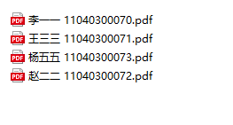
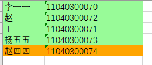

# homework_statistics
### 一个统计人员作业是否交齐的python_excel自动化办公脚本
---
### 目前为使用学号进行统计的版本
### 使用方法:
### 1. 作业命名方式:xxx 180xxx(11位学号).*  
* 例如:李狗蛋 11040300011.pdf
### 2. 需要完整的作业统计表
* 以学号为准

#### 如果该同学已交作业，则将其数据背景变为绿色
#### 否则变为红色背景

### 3.该脚本不会改变原有excel表格，而是在同文件夹下生成输出结果
---
## 操作演示  (如果图裂了请在Demo文件夹中下载gif)

